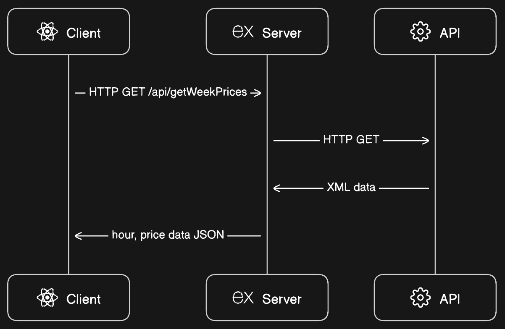
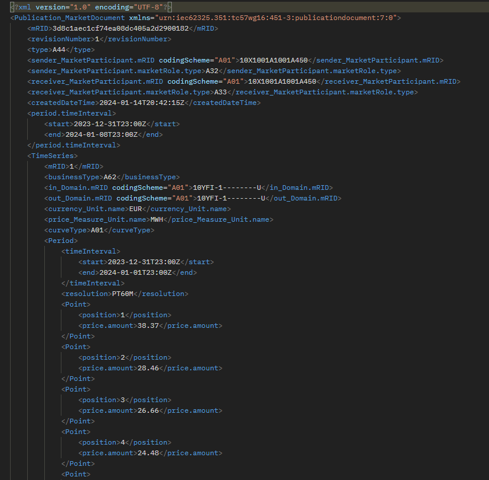
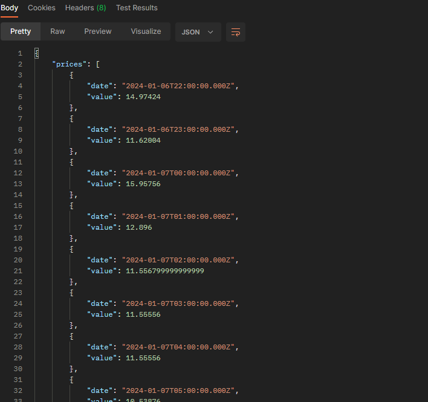
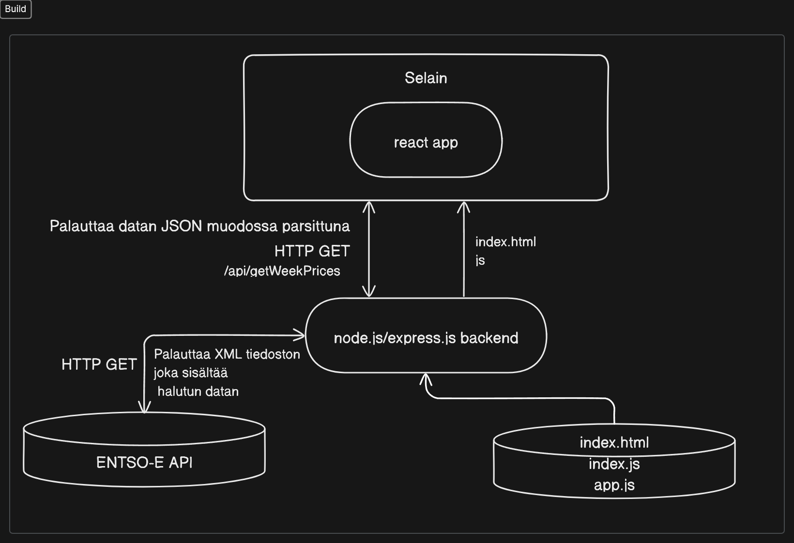

## Yhteenveto
Sovellus joka tällä hetkellä hakee elspot -pörssisähkön tuntihinnan viimeisen 7 päivän ajalta ja visualisoi sen näyttäen myös ajanjakson edullisimman ja kalleimman tuntihinnan. Sovellus näyttää myös senhetkisen tuntihinnan.

## Taustaa
Ohjelma oli rekrytointiprosessissa annettu haaste.

- Suunnittele ja toteuta sovellus, joka hakee sähkön pörssihinnan tunneittain viimeisen 7 päivän ajalta.
- Visualisoi sähkön hinta haluamallasi tavalla. Osoita lisäksi ajanjakson edullisin ja kallein hinta.

## Ohjelma
Ohjelmassa on kolme kokonaisuutta. Vite työkaluympäristössä Reactilla toteutettu front-end client, joka keskustelee serverin kanssa, joka hakee datan <a href="https://transparency.entsoe.eu/content/static_content/Static%20content/web%20api/Guide.html">ENTSO-E:n transparenssialustan restful API:sta.</a>

> ENTSO-E:n ylläpitämä transparenssialusta on keskeinen sähkömarkkinatiedon julkaisupaikka, jonne kerätään tietoa muun muassa sähkön tuotannosta, kulutuksesta, siirroista ja hinnoista koko Euroopan tasolla. Transparenssialusta perustuu EU:n sähkömarkkinoiden läpinäkyvyysasetukseen N:o 543/2013. Transparenssialustan tiedot ovat vapaasti käytössä, ja alustaa kehitetään jatkuvasti. 

Korkean tason API-FLOW kaavio:

ENTSO-E API tarjoaa datan XML muodossa joka haetaan ja parsitaan JSON muotoon serverillä ja palautetaan clientille. Esimerkki ENTSO-E:n API vastauksesta:

Tästä XML vastauksesta parsitaan haluttu data ja se palautetaan JSON muodossa clientille serverin toimesta. Esimerkki:

Tuotantoversio on Express.js serveri, joka tarjoaa build version Reactilla toteutetusta front-endistä ja keskustelee ENTSO-E API:n kanssa. Se rakentaa saadusta XML tiedostosta parsitun JSON tiedoston selaimelle kun selain sitä pyytää. Korkean tason arkkitehtuuri:

GitHub repositorioon on toteutettu yksinkertainen CI/CD automatisointi GitHub Actionsiin. Kun repositorioon pusketaan uusin versio, niin automatisointi buildaa sovelluksesta uusimman version ja lähettää sen <a href="https://learn.microsoft.com/en-us/azure/app-service/deploy-github-actions?tabs=applevel"> Azure App Serviceen. </a>