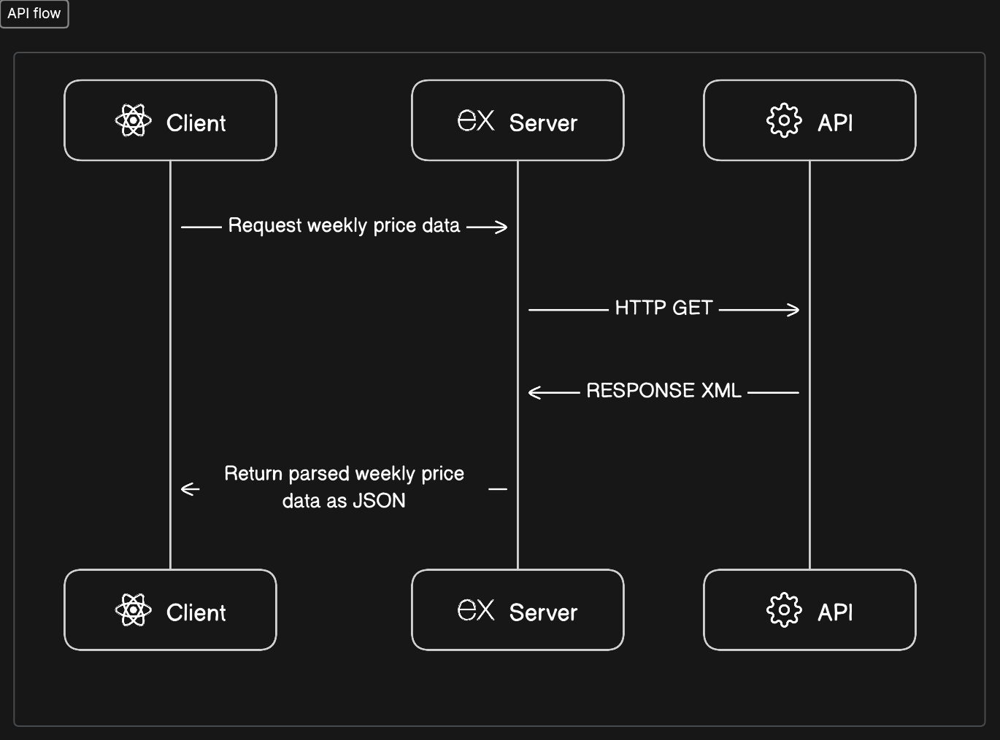
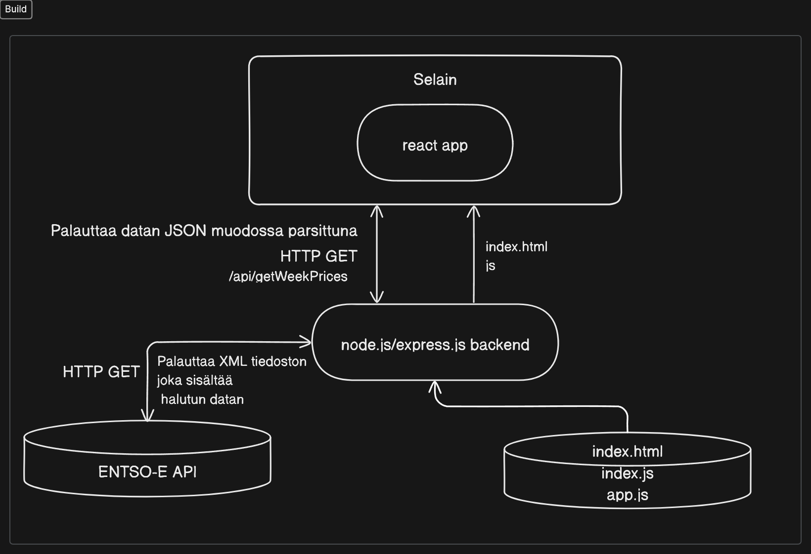

## Yhteenveto
Sovellus joka tällä hetkellä hakee elspot -pörssisähkön tuntihinnan viimeisen 7 päivän ajalta ja visualisoi sen näyttäen myös ajanjakson edullisimman ja kalleimman tuntihinnan. Sovellus näyttää myös senhetkisen tuntihinnan.

## Taustaa
Ohjelma oli rekrytointiprosessissa annettu haaste.

- Suunnittele ja toteuta sovellus, joka hakee sähkön pörssihinnan tunneittain viimeisen 7 päivän ajalta.
- Visualisoi sähkön hinta haluamallasi tavalla. Osoita lisäksi ajanjakson edullisin ja kallein hinta.
## Ohjelma
Ohjelmassa on kolme kokonaisuutta. Vite työkaluympäristössä Reactilla toteutettu front-end client, joka keskustelee serverin kanssa, joka hakee datan ENTSO-E:n transparenssialustan restful API:sta.

> ENTSO-E:n ylläpitämä transparenssialusta on keskeinen sähkömarkkinatiedon julkaisupaikka, jonne kerätään tietoa muun muassa sähkön tuotannosta, kulutuksesta, siirroista ja hinnoista koko Euroopan tasolla. Transparenssialusta perustuu EU:n sähkömarkkinoiden läpinäkyvyysasetukseen N:o 543/2013. Transparenssialustan tiedot ovat vapaasti käytössä, ja alustaa kehitetään jatkuvasti.

Tuotantoversio on Express.js serveri, joka tarjoaa build version React front-endistä ja keskustelee ENTSO-E API:n kanssa ja rakentaa saadusta XML vastauksesta parsitun JSON tiedoston selaimelle.

